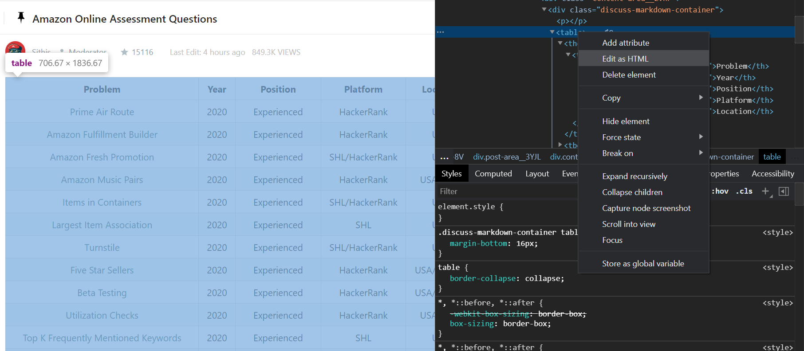
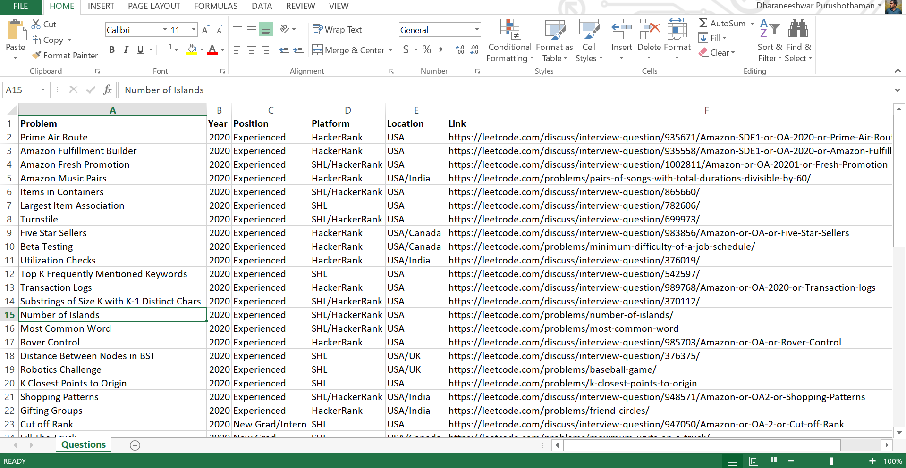
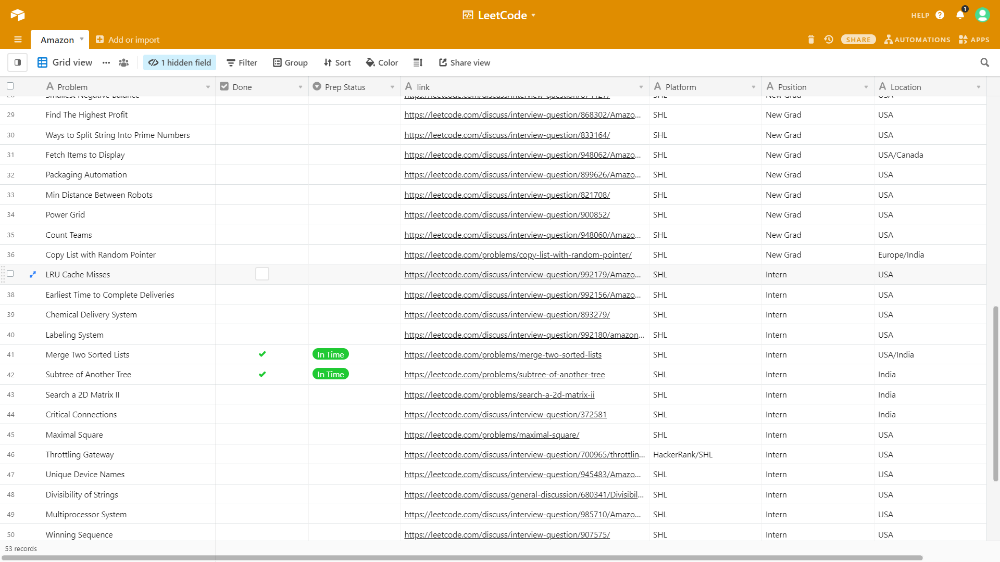

## LeetCode Amazon interview Questions - WebScrapper

This is a fun project that creates the list of questions from [this](https://leetcode.com/discuss/interview-question/344650/Amazon-Online-Assessment-Questions) table into a csv file so that it can be used to import the table in a Spreadsheet tool or Airtable

This Script doesn't scrap the table from the Web as of now. That's for another day! 

The HTML Table code can be copied by inspecting the page



The file `table.py` has the HTML code as a string

`app.py` can scrap the table into a `csv` file with the hyper links

`questions.csv` is the output that we get

This file can be viewed in Spreadsheet.



I use AirTable to keep track of my progress through these questions. The `csv` file can be directly imported in Airtable.



This is pretty useful to track my progress through the list.

```
PS: If you don't find this useful,this is a tiny script I built to refresh by skills in python and webscrapping, and spending 2 Hours for this doesn't seem too bad 😉.
```